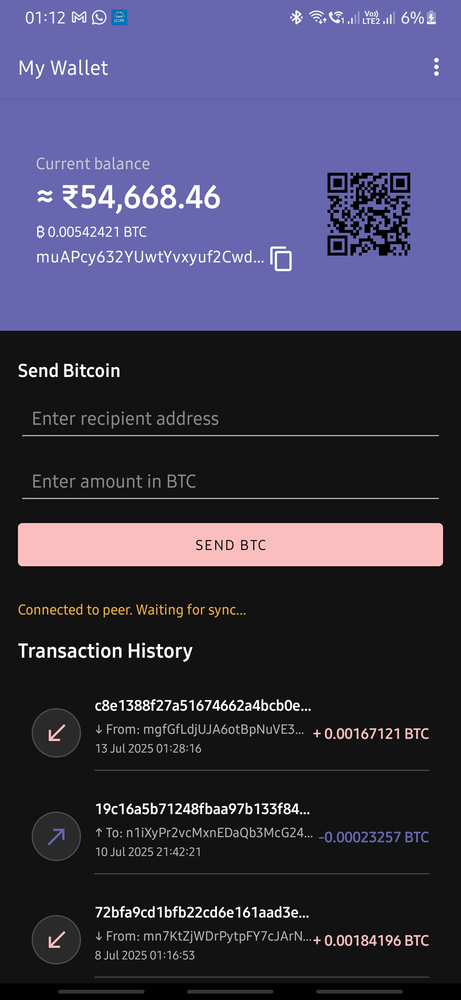

# Crypto Wallet

A Bitcoin wallet Android application built with BitcoinJ library. This app demonstrates core Bitcoin wallet functionality including wallet creation, sending/receiving Bitcoin, and transaction tracking on TestNet.

## Screenshots

 

## Features

- Create and manage Bitcoin wallet (HD wallet with BIP-32/BIP-39)
- Send Bitcoin to any valid address
- Receive Bitcoin with QR code display
- View transaction history with real-time updates
- Balance tracking with SPV sync
- Balance verification via Mempool API
- View cryptocurrency prices

## Technology Stack

**Language:** Kotlin  
**Bitcoin Library:** BitcoinJ 0.16.2  
**Architecture:** MVVM (Model-View-ViewModel)  
**UI:** Material Design Components  
**Networking:** Retrofit + Coroutines  
**QR Codes:** ZXing

## Project Structure

```
app/src/main/java/com/example/crypwallet/
├── MainActivity.kt                 # Main wallet screen
├── CryptoActivity.kt              # Cryptocurrency prices screen
├── WalletViewModel.kt             # Wallet state management
├── WalletManager.kt               # BitcoinJ setup and operations
├── TransactionAdapter.kt          # Transaction list adapter
├── TestnetExplorerApi.kt          # Mempool API interface
└── models/
    ├── WalletState.kt             # Wallet data model
    └── TransactionItem.kt         # Transaction data model
```

## Core Components

**WalletManager**  
Handles BitcoinJ WalletAppKit initialization, network parameters (TestNet3), checkpoint loading, and peer connections.

**WalletViewModel**  
Manages wallet state using LiveData, handles transaction events, generates QR codes, and coordinates wallet operations.

**MainActivity**  
Displays wallet balance, address, QR code, send functionality, and transaction history. Observes ViewModel state for UI updates.

## Key Dependencies

```gradle
// BitcoinJ - Bitcoin protocol implementation
implementation 'org.bitcoinj:bitcoinj-core:0.16.2'

// Retrofit - API calls
implementation 'com.squareup.retrofit2:retrofit:2.9.0'
implementation 'com.squareup.retrofit2:converter-gson:2.9.0'

// ZXing - QR code generation
implementation 'com.google.zxing:core:3.5.0'
```

## Bitcoin Wallet Basics

This application uses BitcoinJ's implementation of:

**SPV (Simplified Payment Verification)**  
Downloads only block headers instead of full blocks, making it efficient for mobile devices.

**HD Wallets (BIP-32)**  
Hierarchical Deterministic key generation from a single seed.

**Mnemonic Seeds (BIP-39)**  
12-word recovery phrase for wallet backup and restoration.

## TestNet Usage

This app operates on Bitcoin TestNet by default. TestNet is a separate blockchain for development and testing where coins have no real value.

**Get Free TestNet Coins:**
- [Mempool TestNet Faucet](https://testnet-faucet.mempool.co/)
- [Bitcoin TestNet Faucet](https://bitcoinfaucet.uo1.net/)

TestNet addresses start with `m`, `n`, or `tb1`. These addresses cannot hold or receive real Bitcoin.

## Wallet Operations

**Creating Wallet**  
Wallet is automatically generated on first launch using BitcoinJ's WalletAppKit. The wallet file is stored locally on the device.

**Sending Bitcoin**
```kotlin
viewModel.sendCoins(toAddress, amountBtc)
```

**Receiving Bitcoin**  
Display the receiving address as text and QR code. Incoming transactions trigger wallet balance updates via event listeners.

**Balance Tracking**  
Balance is tracked via BitcoinJ's internal UTXO management and updated in real-time through Flow/LiveData observers.

## Architecture Pattern

**MVVM with LiveData:**

```
MainActivity (UI Layer)
    ↓
WalletViewModel (Presentation Layer)
    ↓
WalletManager (Data Layer)
    ↓
BitcoinJ WalletAppKit (Bitcoin Network)
```

- UI observes ViewModel LiveData for state changes
- ViewModel coordinates business logic and wallet operations
- WalletManager handles BitcoinJ setup and provides Wallet instance
- All network operations run on background threads via Coroutines

## Data Flow

1. WalletManager initializes WalletAppKit with TestNet parameters
2. Wallet syncs with Bitcoin network via SPV
3. WalletViewModel listens for wallet events (received coins, sync progress)
4. ViewModel updates LiveData state
5. MainActivity observes state changes and updates UI
6. User interactions trigger ViewModel functions
7. ViewModel calls WalletManager methods
8. Changes propagate back through observers

## Important Notes

**Security:**  
- Wallet files are stored unencrypted by default
- Private keys remain on device and are never transmitted
- For production use, implement wallet encryption

**Network:**  
- App uses TestNet3 parameters (`TestNet3Params.get()`)
- To switch to MainNet, change to `MainNetParams.get()` in WalletManager
- MainNet should only be used after thorough testing

**First Sync:**  
- Initial blockchain sync takes 30-60 seconds
- Progress is displayed via sync status updates
- Subsequent launches sync faster using cached headers

**Limitations:**  
- No mnemonic seed backup UI implemented
- No wallet encryption by default
- TestNet only configuration

## Legal Disclaimer

This is an educational project demonstrating BitcoinJ integration for learning purposes. Use at your own risk. Not intended for production use with real Bitcoin without proper security measures.

## License

MIT License
